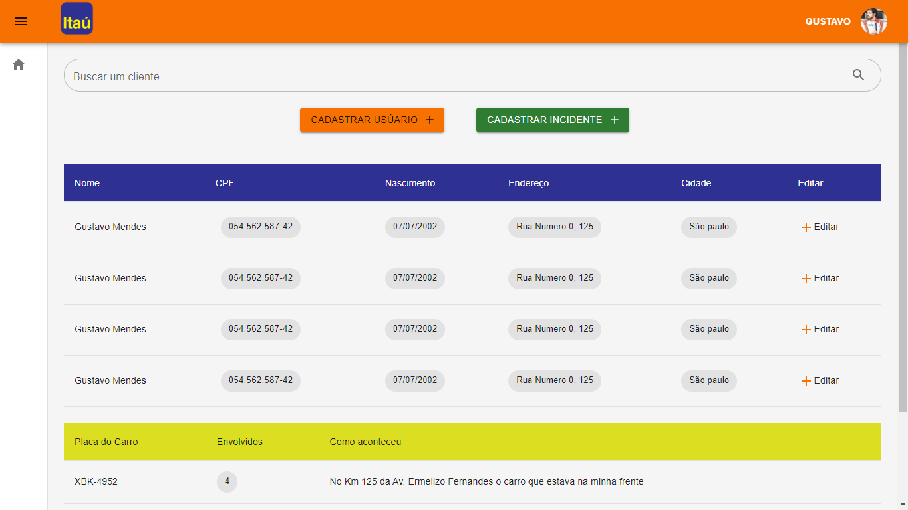

<h1 align="center">

</h1>

<p align="center">
  Sistema de  Gerenciamento  🚀
  <br>
  <br>

</p>

To Do List 🌞

### Front-end ->

[ ] Fazer integração com o Backend
<br>
[ ] Ajustar campos dos modais de inserção com os campos que possui na listagem
<br>
[ ] Ajustar campo de filtrar clientes
<br>
[ ] Dar funcionalidades ao botão de edição
<br>
[ ] Dar funcionalidades ao botão de excluão

### Banco de Dados ->

[ ] Criar Mock de Clientes
<br>
[ ] Criar Mock de Fornecedores
<br>
[ ] Criar Mock de Produtos
<br>
[ ] Criar modelagem para cada uma das 3 tabelas
<br>
[ ] Ajustar Responsividade

## :checkered_flag: Começando

```bash
# Clone this project
$ git clone https://github.com/Gustavo-Developer/CrudImpacta

# Access
$ cd CrudImpact

# Install dependencies
$ npm i

# Start Aplication
$ npm run start

```

## :framed_picture: Imagens

<h1 align="center">
    
</h1># Sistema de gerenciamento
